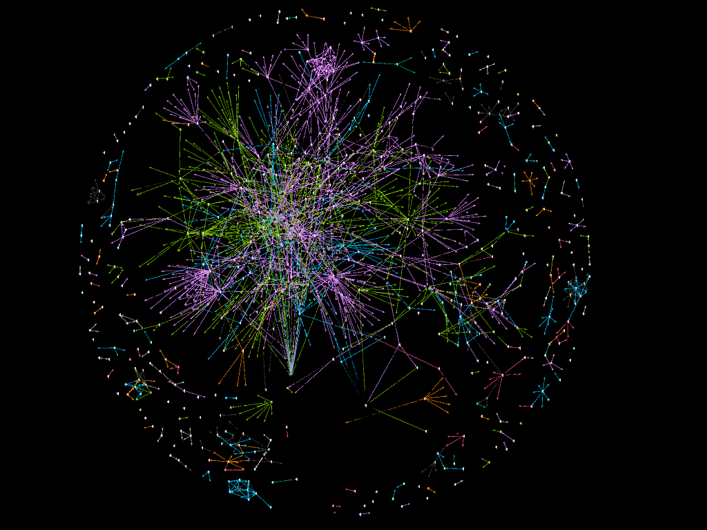
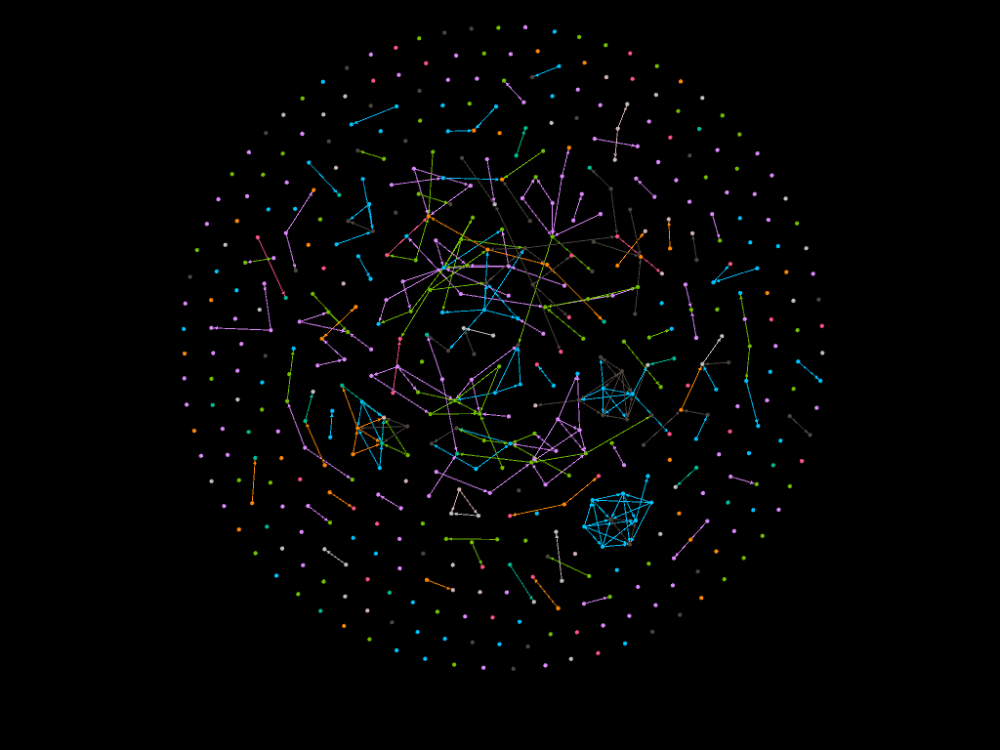

Pytorch-Geometric 라이브러리를 주로 사용하여 다양한 실험들을 진행하였습니다. 실험의 경우 모두 pytorch-geometric dataset class를 사용하여 CustomDataset 클래스를 정의한 후 진행하였습니다. 진행한 실험의 기본적인 흐름은 다음과 같습니다. 

* ** GCN , GAN **:
  EDA과정을 통해 데이터를 탐색 후 기본적인 GCN, GAN 모델을 사용하여 현 데이터셋에 적용하였습니다. 
  두 모델에 대해서는 EDA&First Trial.ipynb Jupyter Notebook 파일을 확인하시면 됩니다. (이외 파일들은 모두 아래 SSP 모델을 기반으로 변형하고 실험한 파일들입니다)
  
* ** SSP **:
  SSP 모델 자체는 'Optimization of Graph Neural Networks with Natural Gradient Descent' 논문에서 사용된 모델입니다. SSP 모델은 새로운 구조도 제시되어 있지만, KFAC라는 옵티마이저를 추가적으로 사용하여 성능향상을 이루어냈다고 합니다. SSP 모델의 경우는 공식 Github 페이지에서 모델레이어 구조나 자체적으로 정의된 optimizer class들과 실행함수들을 가져와, 변형해서 사용하였습니다. 이후, 추가적인 layer를 넣거나 모델 구조를 변환해가면서 실험을 진행하였습니다. 
* 해당 문제는 label imbalance가 심한 문제였습니다. 이를 해결하기 위해서 위 두 경우 모두 아이디어로 loss계산시, 각 label의 개수의 역수를 weight로 주어 학습하는 아이디어를 사용하였으나, imbalanced한 데이터 그대로 학습했을때보다 성능이 좋지 않았습니다.

디렉터리 설명 

> EDA&First Trial.ipynb : 기본적인 EDA 진행과,  GCN, GAN 구조를 사용하여 학습을 시도해본 First Trial들입니다. 한 jupyter notebook에 간단하게 코드 및 결과를 적어보았습니다.
>
> Execution.ipynb : 디렉터리와 파일이 많아 헷갈리실 수 있을 것 같아 따로, 간단한게 실행 명령어를 통해 필요한 task들을 수행할 수 있게 정리해놓았습니다. 
>
> models : 사용된 모델 구조들이 저장된 디렉터리입니다. 
>
> runs : 학습된 모델들의 학습로그들이 기록되어있는 디렉터리입니다. 각각의 모델에 해당하는 폴더가 있고 Tensorboard로 log를 확인할 수 있습니다. 
>
> save : 저장된 binary torch Model 파일입니다. 밑에서 설명할 4가지 모델파일이 저장되어있으며 model_fin.pth가 가장 성능이 좋은 모델입니다. 
>
> image : EDA 및 학습결과와 관련된 모든 이미지들이 저장.
>
> custom_datasets.py : torch_geometric dataset 클래스에 맞게, Data를 변환하는 스크립트입니다.
>
> hyperparameter.py : 처음 최적의 하이퍼파라미터를 찾기 위해서 여러모델들을 각각의 하이퍼파라미터별로 실행시키는 파일입니다. 예시 모델구조만 적혀있습니다.  
>
> gen_dummy_label.py : custom_datasets.py 에서 test label masking을 위해서, test data의 label을 0으로 만들어서 data 디렉터리에 저장하는 파일입니다. 
>
> psgd.py : SSP Model에서 사용한 옵티마이저입니다. 옵티마이저를 사용하여 학습했을때, ADAM 보다 성능이 나아지지 않아서, 해당 옵티마이저를 사용하지 않고 ADAM으로 모델을 학습하였습니다. 
>
> train_eval.py : 모델의 train함수, evaluate 함수를 정의해놓은 파일입니다. 더불어 실행시키는 함수를 정의하였습니다.
>
> run.py : 하이퍼파라미터를 설정하고 모델을 학습시키고 결과(log, model등)를 반환하는 파일입니다. 적절한 환경에서 python run.py 를 실행하면 run.py에 적혀있는 모델들이 models 디렉터리에서 구조를 가져와 순차적으로 학습하고 log들이 runs 디렉터리에 남으며, save 폴더에 학습이 완료된 model이 저장됩니다.  run.py에 적혀있는 하이퍼파라미터는 hyperparameter.py에서 찾아낸 최적의 하이퍼파라미터들입니다.사용한 모델들은 순서대로 

>> 1. original SSP : SSP Github에 있는 모델 그대로,
>> 2. 1번 모델에 추가적인 레이어 및 hidden dim을 늘린 상태로
>> 3. layer Normalization을 추가한 경우 
>> 4. Squeeze and Excitation(SE) Block을 추가한 경우 입니다.

> inference.py : save 디렉터리에 있는 학습된 model들을 사용하여 inference하여 valid 데이터셋에 대한 다양한 성능 평가지표를 계산하거나, test 데이터셋에 대한 예측값을 반환해주는 기능을 정의한 파일입니다. 모델의 성능을 평가하기 위한 지표는 Accuracy를 주된 인자로 사용했으나, sklearn 에서 제공하는 weighted F1, Recall, Precision도 출력해줍니다. (class 확률에 따라 weight를 주어 계산하는 precision, recall, f1-socre). 모델의 성능은 Tensorboard 화면 캡쳐로 Accuracy로 보여드립니다.
>

모델 학습 History

> step 1 (model_ori.pth) : ssp github에 있는 original model과, KFAC Optimizer를 같이 사용한 결과보다 Adam Optimizer를 대신 사용한 결과가 더 나은 성능을 보여, Adam Optimizer로 진행한 결과입니다. 약 24%의 valid Accuracy를 보입니다.  

> step 2 (model_widen.pth) : step 1 model의 hidden dimension을 2배 늘리고, epoch도 길게 해서 학습시킨 결과입니다. 성능개선은 거의 이루어지지 않고 valid accuracy는 25퍼센트로 확인됩니다. 이를 통해, hidden size의 변화나, epoch의 변화는 성능 개선을 이루어내지 못한다고 생각을 하였습니다. 

> step 3 (model_imp.pth) : Normalization Layer를 추가하였습니다. GCNConv Layer에 이미 normalization Step이 있지만, layer출력값을 Normalize하는 데서 더 나은 성능을 낼 거라고 판단하였습니다. 추가적으로 exponential learning rate decay를 0.999로 설정하였을때, validation에서의 성능이 34퍼로 증가하는것을 확인할 수 있었습니다. 조금 더 안정적인 모델링이 learning rate decay를 통해 이루어졌다고 생각합니다. 

> step 4 (model_fin.pth) : Residual Connection과 squeeze-and-Excitation(SE) Layer를 추가하였고 이때, 약 42퍼센트의 성능까지 증가함을 확인할 수 있었습니다. 

* 모델 학습 결과는 runs 디렉터리의 log들로 tensorboard 시각화 한 결과를 보여드리려 합니다. 
  * 각각 traiin_acc, train_loss, val_acc, val_loss를 step1,2,3,4에 대해서 나타낸 결과입니다. 

* 간단한 Gephi 시각화

제언 

* Multi-Class Imbalanced Graph Convolutional Network Learning (IJCAI-20) / GraphSMOTE : Imbalanced Node Classification on Graphs with Graph Neural Networks(ACM 2021) 과 같은 연구를 읽고 참고하면 더 좋을 것 같습니다.   
* Imbalanced한 Node Classification Task에 대해서 더 좋은 아이디어를 Search하거나 생각해낸다면 획기적인 성능향상을 이룰 것으로 기대됩니다. 
* 또한 EDA를 통해 모델링에 feature로 혹은 추가적으로 고려할 사항을 조금 더 잘 찾아낸다면 성능을 높일 수 있을 것으로 기대됩니다. 